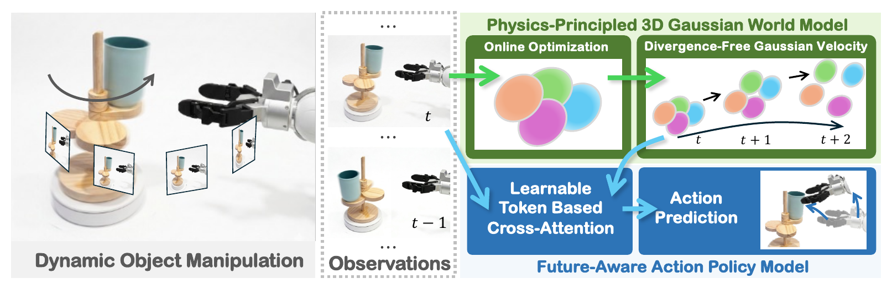

# PhysMani: Physics-principled 3D World Model for Dynamic Object Manipulation

**ECCV 2026**

[](./LICENSE)

<p align="center">
  
</p>

## Overview

PhysMani is a framework for manipulating fast and dynamically moving targets in unstructured 3D environments. It couples a physics-principled 3D Gaussian world model with a future-aware action policy, enabling physically grounded future-dynamics prediction and low-latency action generation.

## Highlights

- **Physics-principled 3D Gaussian world model:** learns a divergence-free Gaussian velocity field through online optimization.
- **Future-aware action policy:** integrates predicted 3D scene dynamics through learnable token-based cross-attention.
- **PhysMani-Bench:** a dynamic manipulation benchmark comprising 16 tasks.
- **Evaluation:** experiments cover both simulation and real-world robot settings.

## Release Status

This repository currently provides the project landing page. Code, data, and pretrained models are not included in this initial release.

## Citation

If you find this work useful, please consider citing:

```bibtex
@inproceedings{yun2026physmani,
  title     = {{PhysMani}: Physics-principled 3D World Model for Dynamic Object Manipulation},
  author    = {Yun, Peng and Huang, Shouwang and Li, Hao and Li, Jinxi and Wang, Jianan and Yang, Bo},
  booktitle = {European Conference on Computer Vision},
  year      = {2026}
}
```

## License

This project is licensed under the [Creative Commons Attribution-NonCommercial-ShareAlike 4.0 International License](./LICENSE).

